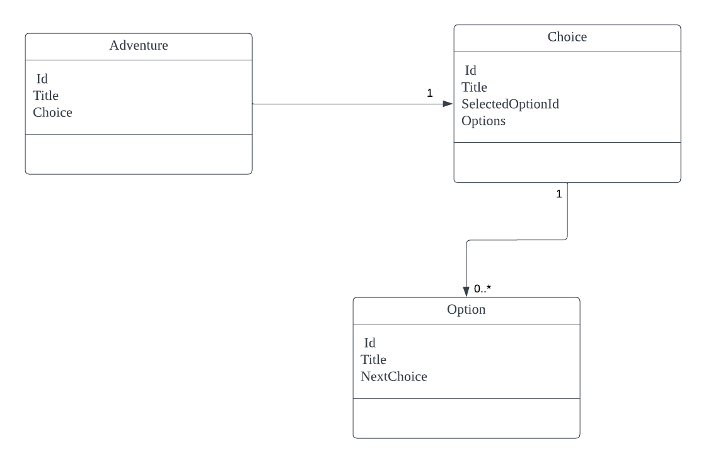

# Create Your Own Adventure. 

## Domain Model 


## Run with Docker

```shell
# execute in root folder.
docker-compose build
docker-compose up
```
alternatively run. This will open up the browser once app is running.
```shell
sh ./start.sh
```

App will be run on [localhost:4200](https://localhost:4200)

Swagger API Page will be presented. 

## Notes
Certain End Points need Authentication 

- /api/adventure/take-adventure
- /api/adventure/my-adventures
- /api/adventure/my-adventure/{adventureId}

## How to Authenticate 

1. Invoke /api/auth/login API with default user name password 
2. Get the JWT token
3. Authorise swagger UI with Authorize Action button in top right coner. Make sure to add token with ``Bearer`` prefix
    ex. 
    ```Bearer token```

# Domain Assumption 
1. AdventureItem Root Object should have atleast one Choice. 
2. Choice can have multiple options. 
3. If No options in Choice means it an End(Final State) of Adventure. 

# Tech Stack 
- ASP.NET (.Net6)
- Mongo DB

# Sample API Test Data

### api/Adventure/create-adventure
```json
{
    "adventure": {
        "choice": {
            "title": "Experience Level",
            "options": [
                {
                    "title": "Beginer",
                    "next": {
                        "title": "Beginner Path",
                        "options": [
                            {
                                "title": "Learn Basics",
                                "next": {
                                    "title": "Sign up for 101 course"
                                }
                            },
                            {
                                "title": "learn by doing",
                                "next": {
                                    "title": "Sign up for Labs"
                                }
                            },
                            {
                                "title": "Watch freeking vedios",
                                "next": {
                                    "title": "Vedio",
                                    "options": [
                                        {
                                            "title": "Live Sessions",
                                            "next": {
                                                "title": "Sign up for Live Sessions"
                                            }
                                        },
                                        {
                                            "title": "Singn up for recorded",
                                            "next": {
                                                "title": "Singn up for recorded"
                                            }
                                        }
                                    ]
                                }
                            }
                        ]
                    }
                },
                {
                    "title": "Intermediate",
                    "next": {
                        "title": "c1",
                        "options": []
                    }
                },
                {
                    "title": "Pro",
                    "next": {
                        "title": "c1",
                        "options": []
                    }
                }
            ]
        }
    }
}
```

### /api/adventure/take-adventure 
``selectedOptionId`` should be provided as chosen option.
```json
{
    "adventure": {
    "title": "Learn Programming - have fun",
    "choice": {
      "id": "6291007deb6fd1012af94f95",
      "selectedOptionId": "6291007deb6fd1012af94f90",
      "title": "Experience Level",
      "options": [
        {
          "id": "6291007deb6fd1012af94f90",
          "title": "Beginer",
          "next": {
            "id": "6291007deb6fd1012af94f8f",
            "selectedOptionId": "6291007deb6fd1012af94f86",
            "title": "Beginner Path",
            "options": [
              {
                "id": "6291007deb6fd1012af94f86",
                "title": "Learn Basics",
                "next": {
                  "id": "6291007deb6fd1012af94f85",
                  "selectedOptionId": null,
                  "title": "Sign up for 101 course",
                  "options": null
                }
              },
              {
                "id": "6291007deb6fd1012af94f88",
                "title": "learn by doing",
                "next": {
                  "id": "6291007deb6fd1012af94f87",
                  "selectedOptionId": null,
                  "title": "Sign up for Labs",
                  "options": null
                }
              },
              {
                "id": "6291007deb6fd1012af94f8e",
                "title": "Watch freeking vedios",
                "next": {
                  "id": "6291007deb6fd1012af94f8d",
                  "selectedOptionId": null,
                  "title": "Vedio",
                  "options": [
                    {
                      "id": "6291007deb6fd1012af94f8a",
                      "title": "Live Sessions",
                      "next": {
                        "id": "6291007deb6fd1012af94f89",
                        "selectedOptionId": null,
                        "title": "Sign up for Live Sessions",
                        "options": null
                      }
                    },
                    {
                      "id": "6291007deb6fd1012af94f8c",
                      "title": "Singn up for recorded",
                      "next": {
                        "id": "6291007deb6fd1012af94f8b",
                        "selectedOptionId": null,
                        "title": "Singn up for recorded",
                        "options": null
                      }
                    }
                  ]
                }
              }
            ]
          }
        },
        {
          "id": "6291007deb6fd1012af94f92",
          "title": "Intermediate",
          "next": {
            "id": "6291007deb6fd1012af94f91",
            "selectedOptionId": null,
            "title": "c1",
            "options": []
          }
        },
        {
          "id": "6291007deb6fd1012af94f94",
          "title": "Pro",
          "next": {
            "id": "6291007deb6fd1012af94f93",
            "selectedOptionId": null,
            "title": "c1",
            "options": []
          }
        }
      ]
    },
    "id": "6291008feb6fd1012af94f96"
  }
}
```